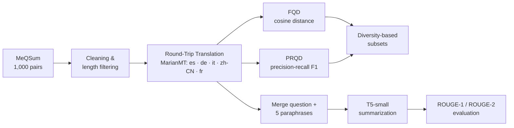

# Medical Question Summarization with Round-Trip Translation

An end-to-end NLP pipeline that paraphrases consumer health questions with **Round-Trip Translation (RTT)**,
measures paraphrase diversity with two embedding-based metrics (**FQD** and **PRQD**), and generates short
question summaries with **T5**, evaluated using **ROUGE**.

Course project for **Modern Information Retrieval** at the University of Tehran.


---

## Table of Contents

- [Overview](#overview)
- [Dataset](#dataset)
- [Pipeline](#pipeline)
- [Methodology](#methodology)
- [Results](#results)
- [Repository Structure](#repository-structure)
- [Getting Started](#getting-started)
- [Notes and Limitations](#notes-and-limitations)
- [References](#references)
- [Author](#author)

---

## Overview

Consumer health questions are usually long and full of peripheral details, which makes them hard to match
against answers in a retrieval system. **Question summarization** rewrites such a question into a short query
that keeps only the core information need.

This project explores whether **multilingual paraphrases** help this task:

1. Each question is translated into five pivot languages and back into English, producing five paraphrases.
2. The diversity between a question and its paraphrases is quantified with **FQD** and **PRQD**, and
   questions whose paraphrases are *diverse but still faithful* are selected.
3. The question and its paraphrases are merged and summarized with **T5-small**.
4. Generated summaries are compared with expert summaries using **ROUGE-1** and **ROUGE-2**.

## Dataset

[**MeQSum**](https://github.com/abachaa/MeQSum) (Ben Abacha & Demner-Fushman, ACL 2019) contains 1,000 consumer
health questions, each paired with a summary written by a medical expert.

| | Example |
|---|---|
| **Question (CHQ)** | *"who makes bromocriptine i am wondering what company makes the drug bromocriptine …"* |
| **Summary** | *"who manufactures bromocriptine"* |

After cleaning and length filtering, **582** question–summary pairs are used. The notebook downloads the dataset
automatically; see [`data/README.md`](data/README.md).

## Pipeline



## Methodology

### 1. Preprocessing (Parts 1–3)

Both questions and summaries are normalized: HTML tags and non-alphanumeric characters are removed, whitespace is
collapsed and the text is lowercased. Rows with missing values are dropped, and only questions of **10–300**
characters and summaries of **5–150** characters are kept.

### 2. Round-Trip Translation (Parts 4–5)

Every question is translated **English → pivot → English** through Spanish, German, Italian, Chinese
(Simplified) and French. Differences in grammar and word choice between languages produce natural paraphrases of
the same question.

Translation uses the open-source **MarianMT** models from [Helsinki-NLP (OPUS-MT)](https://huggingface.co/Helsinki-NLP)
(`opus-mt-en-xx` and `opus-mt-xx-en`), run locally in length-sorted batches (beam search on a GPU, greedy decoding on
a CPU). Back-translations are
normalized with the same cleaning function as the original questions, and the notebook reports how many questions
were actually paraphrased for each language.

> **Why not Google Translate?** The first version of the project used the free Google Translate web endpoint
> (`deep-translator`). Google rate-limits requests from Colab servers (HTTP 429), so every translation failed and the
> original question was silently copied into all paraphrase columns. Local MarianMT models remove this dependency
> and make the paraphrases reproducible.

### 3. FQD — distance-based question diversity (Part 6)

Questions and paraphrases are embedded with `bert-base-uncased` (mean-pooled last hidden state). For a question
$Q$ and a paraphrase $\hat{Q}$:

$$d_{FQD}(Q,\hat{Q}) = 1 - \frac{h_Q \cdot h_{\hat{Q}}}{\lVert h_Q\rVert \, \lVert h_{\hat{Q}}\rVert}$$

The five distances are averaged, min-max normalized to $[0, 1]$, and questions with $0.2 < FQD < 0.8$ are
selected. This drops near-identical paraphrases (no new information) and heavily drifted ones (meaning lost).

### 4. PRQD — precision-recall question diversity (Part 7)

For a scaling factor $\alpha$:

$$\text{prec}(\alpha) = \sum_{v} \min\big(\alpha\, h_Q(v),\ h_{\hat{Q}}(v)\big), \qquad
\text{rec}(\alpha) = \sum_{v} \min\Big(h_Q(v),\ \frac{h_{\hat{Q}}(v)}{\alpha}\Big)$$

$\alpha$ is swept over 10 values in $[0.1, 2]$ and the PRQD of a pair is the **maximum F1** along this curve. Scores
are averaged over the five paraphrases, normalized, and filtered to the range $(0.2, 0.8)$.

### 5. Summarization with T5 (Part 9)

The original question and its five paraphrases are concatenated into one input so that the model sees several
phrasings of the same information need. **T5-small** is used with the `summarize:` prefix (input truncated to 256
tokens), beam search with 4 beams, and a maximum output length of 30 tokens. Inference runs on the GPU when one is
available.

### 6. Evaluation (Part 10)

Generated summaries are scored against the expert summaries with the F1 of **ROUGE-1** (unigram overlap) and
**ROUGE-2** (bigram overlap), using Porter stemming.

## Results

All numbers come from the executed notebook (Google Colab, CPU runtime, so translation used greedy decoding).

### Round-trip translation

| Pivot language | Questions paraphrased (of 582) |
|---|---|
| Spanish (es) | 574 |
| German (de) | 576 |
| Italian (it) | 581 |
| Chinese (zh-CN) | 582 |
| French (fr) | 577 |

Example paraphrases of one question:

| | Text |
|---|---|
| **Original** | *subject who and where to get cetirizine d message i needwant to know who manufscturs cetirizine my walmart is looking for a new supply …* |
| **es** | *… i need to know who manufscturs cetirizine my walmart is looking for a new offer and they are not getting the recent* |
| **de** | *… i need to know who manufactures cetirizine my walmart is looking for a new offer and not get the latest* |
| **zh-CN** | *ask who and where to get the message from cetrizine d i need to know who manufstrs ceterizine is looking for new supplies …* |

### Question diversity

| Metric | Result |
|---|---|
| Mean raw FQD distance (1 − cosine) | 0.0749 |
| Questions selected with 0.2 < FQD < 0.8 | 302 / 582 |
| Questions selected with 0.2 < PRQD < 0.8 | 464 / 582 |

The low raw FQD distance shows that the paraphrases stay semantically close to the original questions, while the
normalized scores still separate near-copies from more diverse paraphrases.

### Summarization (T5-small, zero-shot)

| Metric | Score |
|---|---|
| ROUGE-1 (F1) | **0.2441** |
| ROUGE-2 (F1) | **0.0909** |

**Discussion.** Without fine-tuning, T5-small mostly reproduces the opening words of the question instead of
rewriting it as a short query (e.g. *"subject who and where to get cetirizine d message i needwant to know …"* for the
reference *"who manufactures cetirizine"*). Because the merged input is truncated to 256 tokens, the model mainly sees
the original question and the first one or two paraphrases. For comparison, the first version of the project, in
which translation had silently failed and every paraphrase was a copy of the original question, scored
ROUGE-1 0.2447 / ROUGE-2 0.0941. Adding paraphrases therefore does not measurably change ROUGE in this zero-shot
setting; their benefit would more likely appear when fine-tuning the summarizer on the diversity-selected subsets.

## Repository Structure

```
medical-question-summarization-rtt/
├── notebooks/
│   └── medical_question_summarization_rtt.ipynb   # full pipeline (Parts 1–10)
├── data/
│   └── README.md                                  # dataset description and source
├── requirements.txt
├── LICENSE
└── README.md
```

Intermediate files (`translated_dataset.csv`, `filtered_dataset.csv`, `filtered_dataset2.csv`,
`summarized_dataset.csv`, `evaluated_summaries.csv`) are written to `outputs/` at runtime and are not tracked by git.

## Getting Started

### Option A — Google Colab (recommended)

1. Open `notebooks/medical_question_summarization_rtt.ipynb` in [Google Colab](https://colab.research.google.com/).
2. Select **Runtime → Change runtime type → T4 GPU** (recommended; the notebook also runs on a CPU, but slower).
3. Select **Runtime → Run all**. The dataset and all pre-trained models are downloaded automatically.

### Option B — Local

```bash
git clone https://github.com/sabanaji1014-cloud/medical-question-summarization-rtt.git
cd medical-question-summarization-rtt
python -m venv .venv
source .venv/bin/activate          # Windows: .venv\Scripts\activate
pip install -r requirements.txt
jupyter notebook notebooks/medical_question_summarization_rtt.ipynb
```

Run the notebook from the `notebooks/` folder; `data/` and `outputs/` are created next to it. Internet access is
needed only to download the dataset and the pre-trained models. A GPU is strongly recommended; on a CPU the full
run takes roughly 1–1.5 hours.

## Notes and Limitations

- **Summarization is zero-shot.** T5-small is not fine-tuned on MeQSum, so scores are well below fine-tuned models
  reported in the literature (e.g. ROUGE-1 of 44.16 in the original MeQSum paper).
- **The FQD/PRQD subsets are computed but not used for summarization.** Parts 9–10 summarize the full translated
  dataset; training or evaluating on the selected subsets is a natural next step.
- **PRQD on raw BERT embeddings.** The precision/recall formulation is designed for non-negative vectors, while
  BERT embeddings contain negative values, so absolute PRQD values should be read with care; the normalized scores
  are used only for ranking.
- **Paraphrase quality depends on the translation models.** OPUS-MT models are compact and fast but less fluent
  than large commercial systems, especially for the noisy, typo-heavy questions in MeQSum.

## References

1. A. Ben Abacha and D. Demner-Fushman. *On the Summarization of Consumer Health Questions.* ACL 2019.
   [Paper](https://aclanthology.org/P19-1215) · [Dataset](https://github.com/abachaa/MeQSum)
2. J. Devlin et al. *BERT: Pre-training of Deep Bidirectional Transformers for Language Understanding.* NAACL 2019.
3. J. Tiedemann and S. Thottingal. *OPUS-MT — Building open translation services for the World.* EAMT 2020.
4. C. Raffel et al. *Exploring the Limits of Transfer Learning with a Unified Text-to-Text Transformer (T5).* JMLR 2020.
5. C.-Y. Lin. *ROUGE: A Package for Automatic Evaluation of Summaries.* ACL Workshop 2004.

## Author

**Saba Naji** — University of Tehran

## License

The code is released under the [MIT License](LICENSE). The MeQSum dataset is distributed by its authors under
[CC BY 4.0](https://creativecommons.org/licenses/by/4.0/).
